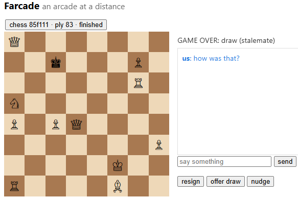
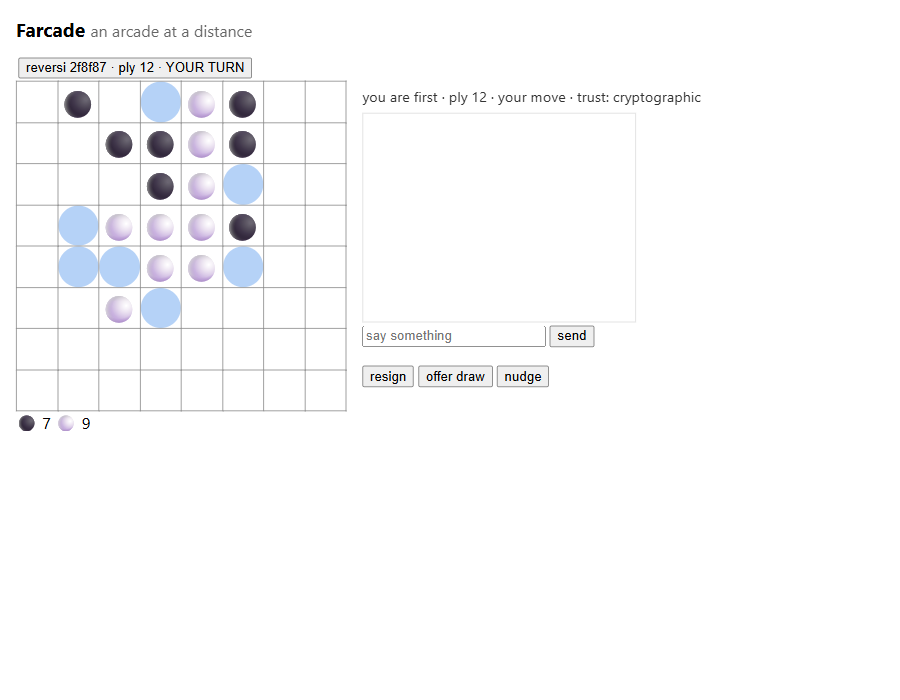

# Farcade

**An arcade at a distance.** Turn-based games, chess first, played peer-to-peer over
low-bandwidth, high-latency links: Reticulum/LXMF today, Meshtastic, SMS, packet radio and
others on the roadmap. With chat, because the conversation is half the point.

Every game doubles as evidence: moves are an ordered, ply-numbered, hash-verified message log,
so a running game continuously measures delivery latency, duplication, reordering and loss on
whatever link carries it. Farcade is a correspondence game platform and an unattended
network soak harness wearing each other's clothes.

## What it looks like

Chess in the browser, with a real stalemate found at ply 83, chat and all:



Reversi mid-game: legal squares highlighted, forced-pass aware, live disc count:



## Design in one breath

State is a pure function of an append-only move log. The ply number is the sequence number.
Every move carries a hash of the resulting state, so divergence is caught on the next ply.
Games, players, voices and transports are all plugins behind narrow ports; the session core
knows none of them.

- **Spec**: [docs/spec.md](docs/spec.md)
- **Plans and work breakdowns**: [docs/sprint-1.md](docs/sprint-1.md), [docs/sprints-2-4.md](docs/sprints-2-4.md)
- **Deploying two peers over Reticulum/prnsd**: [docs/deploy-two-peers.md](docs/deploy-two-peers.md)
- **Why prnsd owns port 37428, with evidence**: [docs/topology-prnsd.md](docs/topology-prnsd.md)

## Status

Latest release **0.3.0**; see [CHANGELOG.md](CHANGELOG.md) for what landed when.

Three games (chess, connect four, reversi) with a minimax opponent, an adversarial channel
harness, and an LXMF transport over Reticulum proven cross-host, engine chess to checkmate with
identical hashes on both sides, then a 24-hour soak that turned into two concurrent ones: 243
games, zero duplicates, zero gaps, zero desyncs. Since then: a serverless lobby (nodes announce a
signed card and hear each other, no registry to run), a Meshtastic transport, and a companion
mode that lets someone play by typing into a stock client with nothing installed.

Interfaces are not stable yet, and the companion mode's live phone acceptance is still open.

## Quick start

```bash
python -m venv .venv && . .venv/bin/activate   # or .venv\Scripts\activate on Windows
pip install -e ".[dev]"
bash scripts/gate.sh                            # format, lint, tests
```
